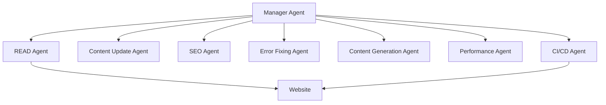

# AgentX: A Comprehensive Guide

## Table of Contents
1. [Introduction](#introduction)
2. [System Architecture](#system-architecture)
3. [Agent Details](#agent-details)
4. [Core Features](#core-features)
5. [Technical Implementation](#technical-implementation)
6. [Setup and Usage](#setup-and-usage)
7. [Advanced Features](#advanced-features)
8. [Troubleshooting](#troubleshooting)

## Introduction

AgentX is an autonomous website maintenance framework that uses artificial intelligence to manage and optimize websites. Think of it as a team of smart AI agents working together, each specialized in different aspects of website maintenance.

### Key Benefits
- **Automated Maintenance**: Reduces manual work in website upkeep
- **Intelligent Updates**: Makes smart decisions about content and structure
- **Continuous Monitoring**: Keeps track of website health 24/7
- **Scalable Architecture**: Can handle websites of any size
- **Learning System**: Improves over time through experience

## System Architecture

### Overview


### Core Components
1. **Agent Network**
   - Distributed system of specialized agents
   - Each agent runs in its own container
   - Communicates via Redis message queue

2. **Memory System**
   ```python
   # Memory Architecture
   - Short-term: Redis Cache
   - Long-term: ChromaDB Vector Store
   - Conversation: Structured Logs
   ```

3. **Monitoring Stack**
   ```yaml
   components:
     - Prometheus: Metrics collection
     - Grafana: Visualization
     - Custom Alerts: Real-time notifications
   ```

## Agent Details

### 1. READ Agent (Port 8001)
**Purpose**: Website content analysis and data gathering

**Capabilities**:
```python
class ReadAgent:
    def __init__(self):
        self.playwright = Playwright()  # For dynamic content
        self.analyzer = ContentAnalyzer()
        
    async def scan_website(self):
        # Scans entire website
        # Captures dynamic content
        # Analyzes page structure
        # Reports to Manager Agent
```

**Tools Used**:
- Playwright for dynamic content
- HTMLHint for HTML validation
- Lighthouse for performance metrics

### 2. Manager Agent (Port 8000)
**Purpose**: Orchestration and coordination

**Key Functions**:
```python
class ManagerAgent:
    def orchestrate(self):
        # Task delegation
        # Priority management
        # Error handling
        # Resource allocation
```

**Decision Making**:
- Uses LangGraph for workflow
- Implements priority queues
- Handles conflict resolution

### 3. Content Update Agent (Port 8002)
**Purpose**: Content freshness and accuracy

**Features**:
```python
class ContentUpdateAgent:
    async def analyze_content(self):
        # Check content age
        # Verify information accuracy
        # Identify update needs
        
    async def update_content(self):
        # Generate updates
        # Maintain style consistency
        # Version control
```

### 4. SEO Optimization Agent (Port 8003)
**Purpose**: Search engine optimization

**Capabilities**:
```python
class SEOAgent:
    def optimize(self):
        # Meta tag optimization
        # Content structure analysis
        # Keyword optimization
        # Schema markup management
```

### 5. Error Fixing Agent (Port 8004)
**Purpose**: Technical issue resolution

**Functions**:
```python
class ErrorFixingAgent:
    async def scan_for_errors(self):
        # Check for broken links
        # Validate HTML/CSS
        # Test functionality
        
    async def fix_errors(self):
        # Automated repairs
        # Regression testing
        # Fix verification
```

### 6. Content Generation Agent (Port 8005)
**Purpose**: New content creation

**Features**:
```python
class ContentGenerationAgent:
    def generate_content(self):
        # Topic analysis
        # Content creation
        # Style matching
        # Quality assurance
```

### 7. Performance Monitor Agent (Port 8006)
**Purpose**: Performance optimization

**Metrics Tracked**:
```python
class PerformanceAgent:
    def monitor(self):
        # Page load times
        # Resource usage
        # User experience metrics
        # Server response times
```

### 8. CI/CD Deployment Agent (Port 8007)
**Purpose**: Safe deployment of changes

**Process**:
```python
class DeploymentAgent:
    async def deploy(self):
        # Create GitHub PR
        # Run tests
        # Stage changes
        # Deploy safely
```

## Core Features

### 1. Memory Management
```python
# Implementation
class MemorySystem:
    def __init__(self):
        self.short_term = RedisCache()
        self.long_term = ChromaDB()
        self.conversations = ConversationLog()
        
    def store_experience(self, data):
        # Process and store experiences
        # Index for quick retrieval
        # Maintain context
```

### 2. Safety Mechanisms
```yaml
safety_features:
  - Automatic backups
  - Rollback capability
  - Test environment
  - Gradual deployment
  - Monitoring alerts
```

### 3. Learning System
```python
class LearningSystem:
    def learn_from_experience(self):
        # Pattern recognition
        # Success rate analysis
        # Strategy adaptation
        # Performance optimization
```

## Technical Implementation

### Docker Setup
```dockerfile
# Base configuration
FROM python:3.9-slim
RUN apt-get update && apt-get install -y \
    build-essential \
    chromium \
    nodejs \
    npm
```

### Environment Configuration
```bash
# Required environment variables
GOOGLE_API_KEY=your_key
GITHUB_TOKEN=your_token
TARGET_WEBSITE=your_site
```

### Network Configuration
```yaml
ports:
  - Manager: 8000
  - READ: 8001
  - Content: 8002
  - SEO: 8003
  - Error: 8004
  - Generator: 8005
  - Performance: 8006
  - Deployment: 8007
```

## Setup and Usage

### Initial Setup
```bash
# Installation
pip install agentx

# Configuration
agentx init
```

### Basic Usage
```bash
# Start the system
agentx run

# Development mode
agentx dev

# Build for production
agentx build
```

### Configuration File
```yaml
# agentx.config.yaml
website_url: https://example.com
agents:
  content_update: true
  seo_optimization: true
  error_fixing: true
schedule:
  frequency: daily
  time: "00:00"
```

## Advanced Features

### Custom Agent Development
```python
from agentx.base import BaseAgent

class CustomAgent(BaseAgent):
    def __init__(self):
        super().__init__()
        
    async def process(self):
        # Custom logic here
```

### Monitoring Setup
```yaml
# prometheus.yml
scrape_configs:
  - job_name: 'agentx'
    static_configs:
      - targets: ['localhost:8000']
```

### Alert Configuration
```yaml
# alerts.yml
alerts:
  - name: high_error_rate
    condition: error_rate > 0.1
    severity: critical
```

## Troubleshooting

### Common Issues
1. **Agent Communication Errors**
   ```bash
   # Check Redis connection
   redis-cli ping
   ```

2. **Memory Issues**
   ```bash
   # Clear cache
   agentx clear-cache
   ```

3. **Performance Problems**
   ```bash
   # Check metrics
   curl localhost:9090/metrics
   ```

### Debug Mode
```bash
# Enable debug logging
export LOG_LEVEL=DEBUG
agentx run --verbose
```

### Support Resources
- Documentation: `/docs`
- Issue Tracker: GitHub Issues
- Community: Discord Server

---

This guide will be updated regularly as the system evolves. For the latest information, check the GitHub repository. 